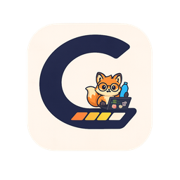
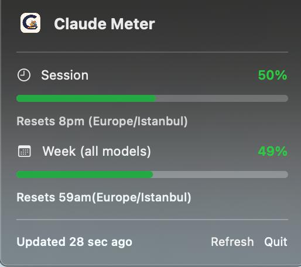

# Claude Meter 🌡️

<p align="center">
  
</p>

A lightweight macOS menu bar app that shows your Claude Code subscription usage — session % and weekly % — at a glance.

<p align="center">
  
  &nbsp;&nbsp;&nbsp;
  
</p>

## Features

- **Session usage** — how much of your current session limit you've used
- **Weekly usage** — how much of your weekly limit across all models
- **Reset times** — when each limit resets
- **Color-coded** — green → orange → red as you approach limits
- **Auto-refresh** every 5 minutes
- **Manual refresh** from the dropdown

## Requirements

- macOS 13+ (Ventura or later)
- [Claude Code CLI](https://claude.ai/code) installed and logged in

## Installation

### 1. Install Claude Code CLI

```bash
npm install -g @anthropic-ai/claude-code
claude login
```

### 2. Build the app

```bash
git clone https://github.com/EmreYigitAlparslan/claude-meter.git
cd claude-meter
open ClaudeUsage/ClaudeUsageApp/ClaudeUsageApp.xcodeproj
```

In Xcode:
- Select the `ClaudeUsageApp` target
- Remove **App Sandbox** from Signing & Capabilities (it's a local tool, not App Store)
- **Product → Archive → Distribute App → Copy App**
- Move `ClaudeUsageApp.app` to `/Applications`

### 3. Launch at login (optional)

System Settings → General → Login Items → add `ClaudeUsageApp`

## How it works

Claude Meter runs `claude /usage` in a pseudo-terminal (PTY) using Python's `pty` module, captures the terminal output, strips ANSI codes, and parses the usage percentages. No API calls, no credentials stored — it reads directly from your local Claude Code session.

## Privacy

- No data leaves your machine
- No API keys or tokens stored
- Reads only what `claude /usage` outputs locally

## Contributing

PRs welcome. The core logic is in two files:
- `fetch_usage.py` — PTY interaction + parsing
- `UsageMonitor.swift` — runs the script, feeds data to SwiftUI

## License

MIT
